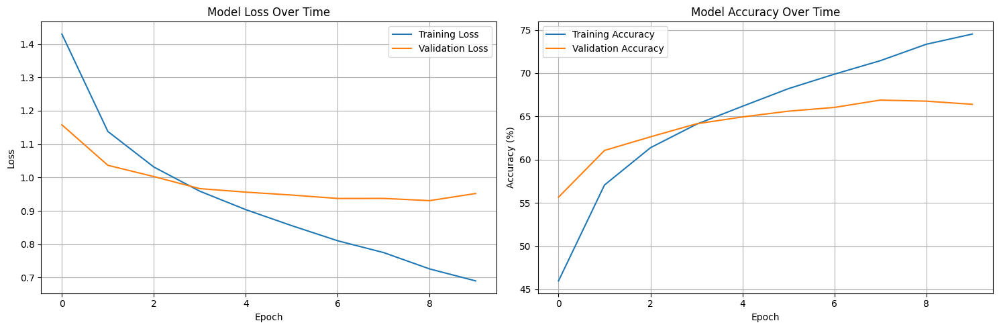
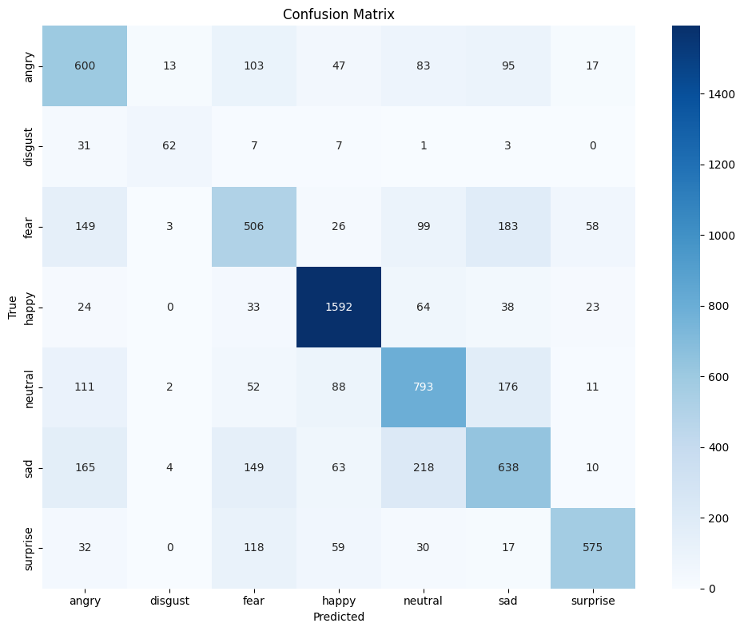

# Facial Emotion Recognition with ResNet18

  

This project implements a deep learning solution for recognizing emotions from facial expressions using a fine-tuned ResNet18 architecture. The model classifies faces into seven universal emotions: angry, disgust, fear, happy, neutral, sad, and surprise.

## Table of Contents

- [Project Overview](#project-overview)
- [Technical Highlights](#technical-highlights)
- [Installation](#installation)
- [Dataset](#dataset)
- [Model Architecture](#model-architecture)
- [Data Augmentation](#data-augmentation)
- [Training Pipeline](#training-pipeline)
- [Evaluation and Results](#evaluation-and-results)
- [Usage](#usage)
- [References](#references)

## Project Overview

Facial emotion recognition has applications in numerous fields including:

- Human-computer interaction
- Mental health monitoring
- Customer sentiment analysis
- Educational technology
- Accessibility solutions

This project demonstrates how transfer learning can be effectively applied to the challenging task of emotion recognition by fine-tuning a pre-trained CNN architecture.

## Technical Highlights

- **Transfer Learning**: Leverages ImageNet-pretrained ResNet18 for efficient training
- **Architecture Adaptation**: Modified for grayscale input while preserving learned features
- **Selective Layer Freezing**: Strategically unfreezes specific layers for optimal fine-tuning
- **Advanced Data Augmentation**: Implements multiple augmentation techniques to improve generalization
- **Learning Rate Scheduling**: Uses ReduceLROnPlateau to optimize training
- **Gradient Clipping**: Prevents exploding gradients during backpropagation
- **Best Model Checkpointing**: Saves the model with highest validation accuracy

## Installation

### Prerequisites

To run this project, you need Python 3.6+ and the following packages:

```bash
pip install torch torchvision numpy pandas opencv-python Pillow scikit-learn matplotlib seaborn tqdm
```

### Clone the Repository

```bash
git clone https://github.com/yourusername/emotion-detector.git
cd emotion-detector
```

## Dataset

The model is trained on the FER2013 (Facial Expression Recognition 2013) dataset, which contains 35,887 grayscale images of faces categorized into seven emotions.

### Dataset Structure

```
fer2013/
├── train/
│   ├── angry/
│   ├── disgust/
│   ├── fear/
│   ├── happy/
│   ├── neutral/
│   ├── sad/
│   └── surprise/
└── test/
    ├── angry/
    ├── disgust/
    ├── fear/
    ├── happy/
    ├── neutral/
    ├── sad/
    └── surprise/
```

### Emotion Distribution

The dataset contains seven emotion categories represented by the following mapping:

```python
EMOTIONS = {
    'angry': 0,
    'disgust': 1,
    'fear': 2,
    'happy': 3,
    'neutral': 4,
    'sad': 5,
    'surprise': 6
}
```

## Model Architecture

### ResNet18 Base Model

ResNet (Residual Network) is known for its skip connections that help mitigate the vanishing gradient problem in deep networks. ResNet18 has 18 layers and provides an excellent balance of depth and computational efficiency.

### Custom Modifications

```python
def create_resnet18_model(num_classes=7):
    # Load pretrained model
    model = resnet18(weights='IMAGENET1K_V1')

    # Modify for grayscale input
    original_conv = model.conv1.weight.data
    model.conv1 = nn.Conv2d(1, 64, kernel_size=7, stride=2, padding=3, bias=False)
    model.conv1.weight.data = original_conv.mean(dim=1, keepdim=True)

    # Strategic layer freezing/unfreezing
    layers_to_unfreeze = ['layer3', 'layer4', 'fc']
    for name, param in model.named_parameters():
        param.requires_grad = any(layer in name for layer in layers_to_unfreeze)

    # Replace final classifier
    num_features = model.fc.in_features
    model.fc = nn.Sequential(
        nn.Dropout(0.5),
        nn.Linear(num_features, num_classes)
    )

    return model
```

## Data Augmentation

To enhance model robustness and generalization, a comprehensive set of data augmentations is applied to the training images:

### Training Transformations

```python
train_transform = T.Compose([
    T.Lambda(lambda x: Image.fromarray(x)),  # Convert numpy array to PIL Image
    T.Resize((224, 224)),
    T.RandomHorizontalFlip(p=0.5),
    T.RandomRotation(10),
    T.RandomAffine(degrees=0, translate=(0.05, 0.05), scale=(0.95, 1.05)),
    T.RandomAdjustSharpness(sharpness_factor=1.5, p=0.3),
    T.RandomAutocontrast(p=0.3),
    T.ToTensor(),
    T.Normalize(mean=[0.485], std=[0.229])
])
```

### Testing Transformations

For evaluation, only resizing and normalization are applied:

```python
test_transform = T.Compose([
    T.Lambda(lambda x: Image.fromarray(x)),
    T.Resize((224, 224)),
    T.ToTensor(),
    T.Normalize(mean=[0.485], std=[0.229])
])
```

## Training Pipeline

### Custom Dataset Implementation

A custom `FERDataset` class inherits from PyTorch's `Dataset` class to load and preprocess the images:

```python
class FERDataset(Dataset):
    def __init__(self, data_dir, transform=None):
        self.transform = transform
        self.images = []
        self.labels = []

        # Get all images and labels
        for emotion, label in EMOTIONS.items():
            path = os.path.join(data_dir, emotion)
            if not os.path.exists(path):
                continue
            for img in os.listdir(path):
                self.images.append(os.path.join(path, img))
                self.labels.append(label)

    def __getitem__(self, idx):
        # Read image as grayscale
        image = cv2.imread(self.images[idx], cv2.IMREAD_GRAYSCALE)
        if self.transform:
            image = self.transform(image)
        return image, self.labels[idx]

    def __len__(self):
        return len(self.images)
```

### Optimizer Configuration

The training uses AdamW optimizer with different learning rates for different layers:

```python
optimizer = optim.AdamW([
    {'params': model.conv1.parameters(), 'lr': learning_rate * 0.1},
    {'params': model.layer3.parameters(), 'lr': learning_rate * 0.3},
    {'params': model.layer4.parameters(), 'lr': learning_rate * 0.5},
    {'params': model.fc.parameters(), 'lr': learning_rate}
], weight_decay=0.01)
```

### Learning Rate Scheduler

To manage learning rates dynamically during training:

```python
scheduler = ReduceLROnPlateau(optimizer, mode='min', factor=0.5, patience=2, verbose=True)
```

### Training Loop

The training process includes:

1. Forward pass and loss computation
2. Backward pass with gradient clipping
3. Optimization step
4. Metrics tracking for both train and validation sets
5. Model checkpointing based on validation accuracy

## Evaluation and Results

### Performance Metrics

The model achieves the following performance:

- **Best Training Accuracy**: ~74.52%
- **Best Validation Accuracy**: ~66.88%
- **Final Training Loss**: 0.64
- **Final Validation Loss**: 0.98

### Visualizations

#### Training History



#### Confusion Matrix




### Classification Report

```
              precision    recall  f1-score   support
       angry      0.61      0.59      0.60       958
     disgust      0.72      0.58      0.64       111
        fear      0.48      0.50      0.49       937
       happy      0.86      0.88      0.87      1774
     neutral      0.63      0.65      0.64      1233
         sad      0.57      0.55      0.56      1247
    surprise      0.81      0.80      0.81       831
```

## Usage

### Inference on a Single Image

```python
def predict_emotion(image_path, model):
    # Load image and preprocess
    image = cv2.imread(image_path, cv2.IMREAD_GRAYSCALE)
    image_tensor = test_transform(image).unsqueeze(0).to(device)

    # Get prediction
    model.eval()
    with torch.no_grad():
        output = model(image_tensor)
        _, predicted = torch.max(output, 1)
        emotion_idx = predicted.item()

    # Map index to emotion
    emotions = list(EMOTIONS.keys())
    return emotions[emotion_idx]

# Example usage
emotion = predict_emotion("path/to/image.jpg", model)
print(f"Predicted emotion: {emotion}")
```

### Loading a Saved Model

```python
def load_model(model_path, num_classes=7):
    model = create_resnet18_model(num_classes)
    checkpoint = torch.load(model_path)
    model.load_state_dict(checkpoint['model_state_dict'])
    model.to(device)
    return model

# Example usage
model = load_model("best_model.pth")
```

## References

- FER2013 Dataset: [Kaggle](https://www.kaggle.com/datasets/msambare/fer2013)
- ResNet Architecture: [Deep Residual Learning for Image Recognition](https://arxiv.org/abs/1512.03385)
- Transfer Learning: [A Survey on Transfer Learning](https://www.cse.ust.hk/~qyang/Docs/2009/tkde_transfer_learning.pdf)